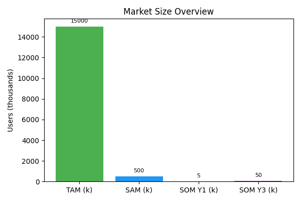

# Market Sizing

The global retail trading market includes roughly 15 million active accounts (TAM). Of those, around 500 k traders have the sophistication and capital to adopt algorithmic strategies (SAM). ReFi.Trading’s initial obtainable market (SOM) comprises 5 k users in year 1, growing to 50 k users by year 3 as the platform launches in additional jurisdictions and expands product offerings. Market sizing is based on industry reports, broker data and assumptions about adoption rates in the GCC, North America and Europe.