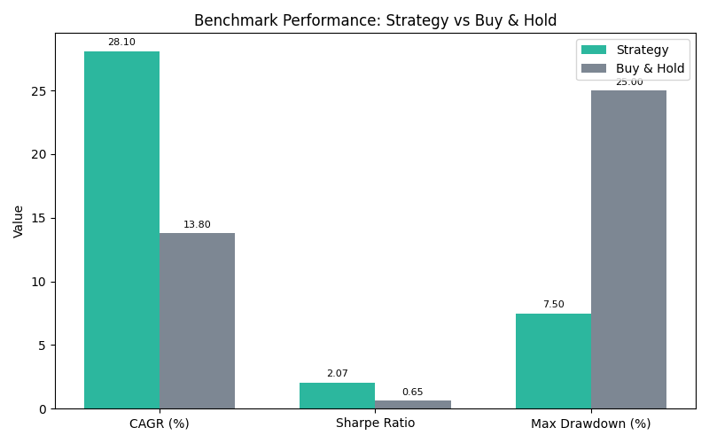

# Reinforcement Learning Agent Performance

 - **Backtests:** A 3.1‑year walk‑forward benchmark (April 2022 – May 2025) produced a 28.1 % compound annual growth rate, a Sharpe ratio of 2.07 (95 % CI 1.00 – 3.16) and a maximum drawdown of 7.5 %. An equal‑weight buy‑and‑hold portfolio returned 13.8 % CAGR with a 0.65 Sharpe ratio and a 25 % drawdown. The strategy’s Expected‑Shortfall at the 99 % level is −2.8 %.
 - **Paper trading:** Early alpha users still report a win rate around 52 % in simulation mode with conservative risk caps. Future updates will incorporate risk‑adjusted metrics similar to the walk‑forward benchmark.
- **Risk controls:** Agents employ value‑at‑risk limits, maximum position sizes and progressive caps to reduce drawdown. Users can adjust risk parameters per agent.

Once licensing is obtained the platform will publish live performance metrics with transparent audit trails.