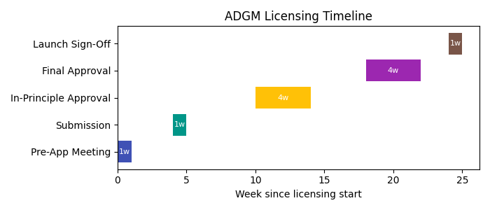

# Regulatory Strategy

ReFi.Trading is not yet licensed for live trading. The platform currently operates in paper trading mode only. To enable live trading the company is pursuing two parallel pathways:

1. **UAE ADGM Category 3A licence:**
   - Category 3A allows dealing in investments as agent and arranging deals without custody.
   - Minimum regulatory capital: US $250 k (simplified approach). Additional US $500 k base capital requirement for 3A firms; may increase if offering leveraged products.
   - Application fee: around US $20 k with annual supervision cost of US $15 k.
   - Requires incorporation of an ADGM SPV, appointment of senior executive officer, compliance officer, finance officer and resident presence.
   - Timeline: 18–22 weeks from pre‑application to final approval.

2. **White‑label partnership:**
   - Partner with a licensed broker (e.g., Saxo Bank) to offer live trading under their regulatory umbrella.
   - Faster time to market (4–8 weeks) but shares revenue and relies on partner compliance.

In both scenarios the company will continue to run paper trading in parallel to build trust and gather data.