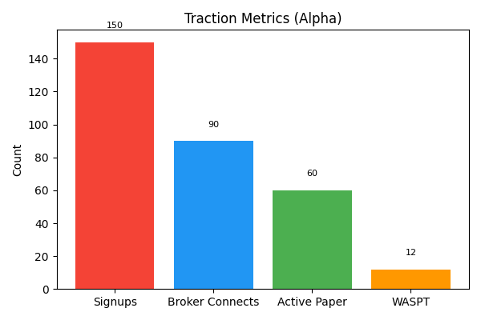

# Current Traction

ReFi.Trading is in alpha with paper trading only. Key early metrics include:

- **Signups:** 150 alpha signups targeted in the first month.
- **Broker Connections:** Goal of 60 % of signups connecting a broker.
- **Paper Trading Active:** Goal of 92 % of connected users executing paper trades.
- **Weekly Active Safe Paper Traders (WASPT):** Goal of 40 within three months.

These metrics will be updated monthly. Retention, conversion to live trading and net promoter score will be tracked once the platform is licensed.